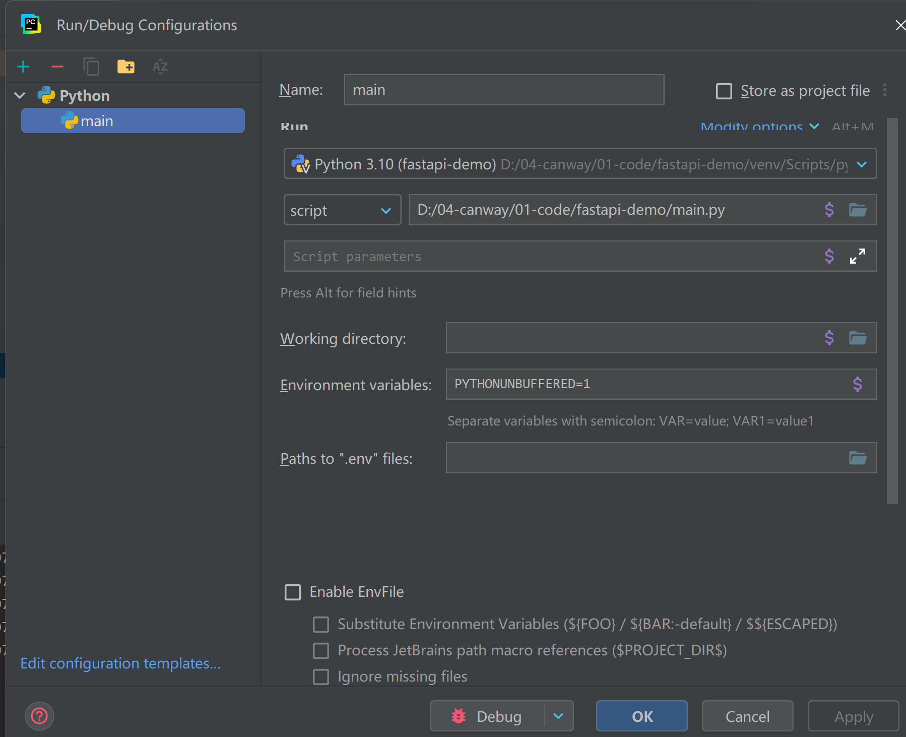
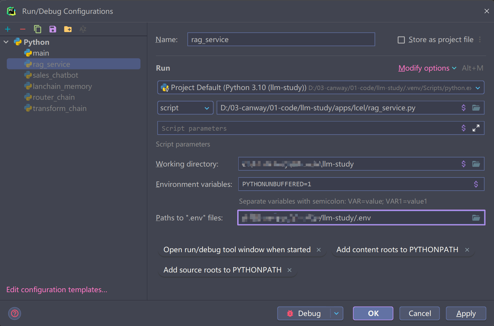

# 一、开发配置

## 开发环境变量配置.env

根目录下，创建一个.env文件，内如如下

```python
APP_HOST=0.0.0.0
APP_PORT=8080
ENV=dev
OPEN_API_KEY=""
```

## pycharm启动配置

项目启动



练习测试启动



二、启动命令

* 启动命令：`uvicorn hello_world:app --reload`
* `swagger api: http://127.0.0.1:8080/docs

# 三、学习参考

参考：https://github.com/DjangoPeng/openai-quickstart
