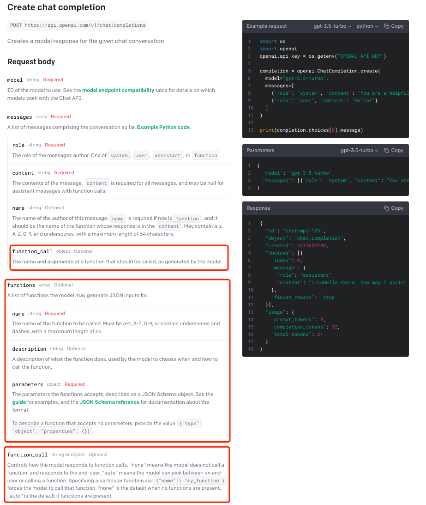

# 基于 Chat Completions API 实现外部函数调用

**2023年6月20日，OpenAI 官方在 Chat Completions API 原有的三种不同角色设定（System, Assistant, User）基础上，新增了 Function Calling 功能。**

`functions` 是 Chat Completion API 中的可选参数，用于提供函数定义。其目的是使 GPT 模型能够生成符合所提供定义的函数参数。请注意，API不会实际执行任何函数调用。开发人员需要使用GPT 模型输出来执行函数调用。

如果提供了`functions`参数，默认情况下，GPT 模型将决定在何时适当地使用其中一个函数。

可以通过将`function_call`参数设置为`{"name": "<insert-function-name>"}`来强制 API 使用指定函数。

同时，也支持通过将`function_call`参数设置为`"none"`来强制API不使用任何函数。

如果使用了某个函数，则响应中的输出将包含`"finish_reason": "function_call"`，以及一个具有该函数名称和生成的函数参数的`function_call`对象。




# function_calling 执行日志
```python
system: Don't make assumptions about what values to plug into functions. Ask for clarification if a user request is ambiguous.

user: What's the weather like today

assistant[content]: Sure, could you please provide me with the city and state for which you would like to know the weather?

[{'role': 'system', 'content': "Don't make assumptions about what values to plug into functions. Ask for clarification if a user request is ambiguous."}, {'role': 'user', 'content': "What's the weather like today"}, {'role': 'assistant', 'content': 'Sure, could you please provide me with the city and state for which you would like to know the weather?', 'refusal': None}]
system: Don't make assumptions about what values to plug into functions. Ask for clarification if a user request is ambiguous.

user: What's the weather like today

assistant[content]: Sure, could you please provide me with the city and state for which you would like to know the weather?

user: I'm in Shanghai, China.

assistant[function_call]: {'name': 'get_current_weather', 'arguments': '{"location":"Shanghai, China","format":"celsius"}'}

[{'role': 'system', 'content': "Don't make assumptions about what values to plug into functions. Ask for clarification if a user request is ambiguous."}, {'role': 'user', 'content': "What's the weather like today"}, {'role': 'assistant', 'content': 'Sure, could you please provide me with the city and state for which you would like to know the weather?', 'refusal': None}, {'role': 'user', 'content': "I'm in Shanghai, China."}, {'role': 'assistant', 'content': None, 'function_call': {'name': 'get_current_weather', 'arguments': '{"location":"Shanghai, China","format":"celsius"}'}, 'refusal': None}]

```