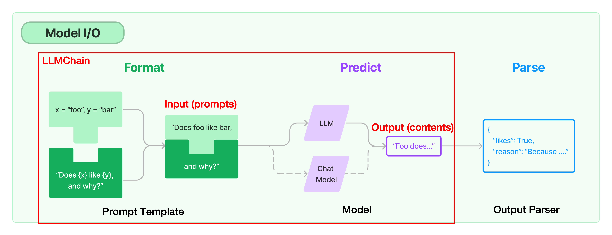
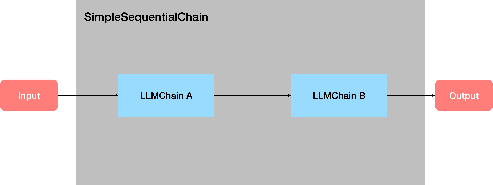
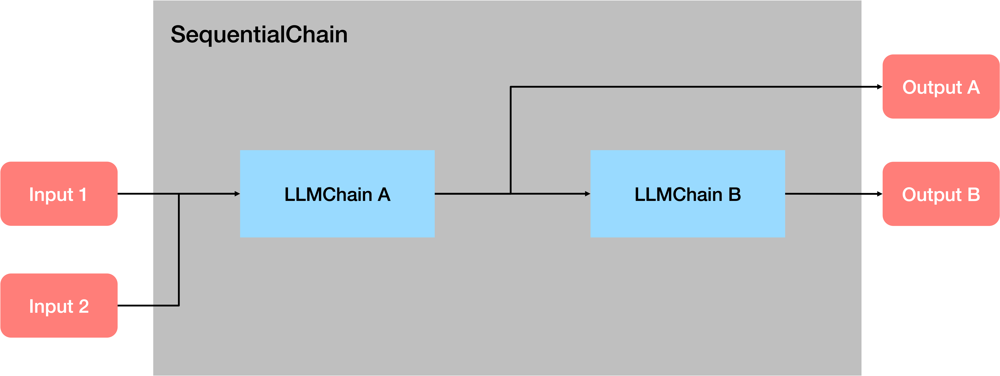
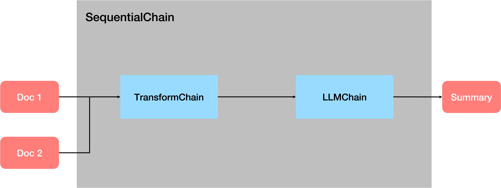
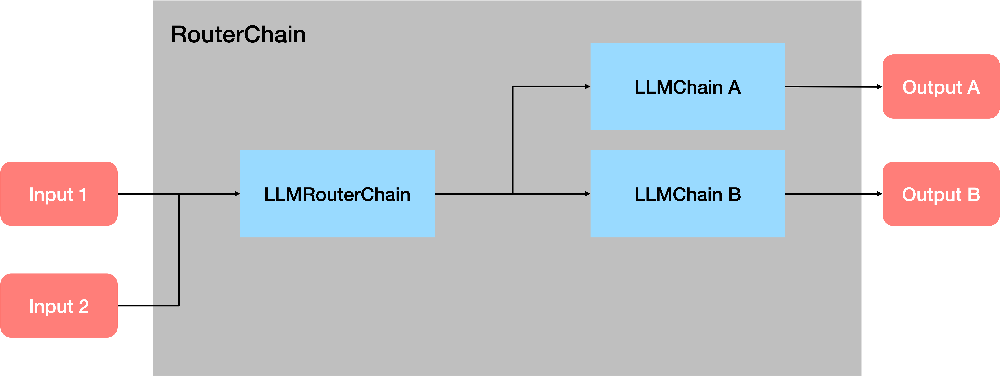

## LLMChain

LLMChain 是 LangChain 中最简单的链，作为其他复杂 Chains 和 Agents 的内部调用，被广泛应用。

一个LLMChain由PromptTemplate和语言模型（LLM or Chat Model）组成。它使用直接传入（或 memory 提供）的 key-value 来规范化生成 Prompt Template（提示模板），并将生成的 prompt （格式化后的字符串）传递给大模型，并返回大模型输出。

## Sequential Chain

串联式调用语言模型（将一个调用的输出作为另一个调用的输入）。

顺序链（Sequential Chain ）允许用户连接多个链并将它们组合成执行特定场景的流水线（Pipeline）。有两种类型的顺序链：

* SimpleSequentialChain：最简单形式的顺序链，每个步骤都具有单一输入/输出，并且一个步骤的输出是下一个步骤的输入。
* SequentialChain：更通用形式的顺序链，允许多个输入/输出。

### 使用 SimpleSequentialChain 实现戏剧摘要和评论（单输入/单输出）

### 使用 SequentialChain 实现戏剧摘要和评论（多输入/多输出）

## Transform Chain: 实现快捷处理超长文本

## Router Chain: 实现条件判断的大模型调用

这段代码构建了一个可定制的链路系统，用户可以提供不同的输入提示，并根据这些提示获取适当的响应。

主要逻辑：从`prompt_infos`创建多个`LLMChain`对象，并将它们保存在一个字典中，然后创建一个默认的`ConversationChain`，最后创建一个带有路由功能的`MultiPromptChain`。

