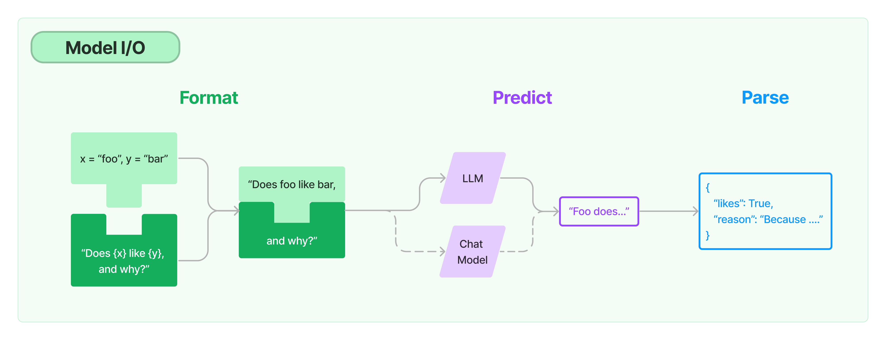

# LangChain 核心模块学习：Model I/O

`Model I/O` 是 LangChain 为开发者提供的一套面向 LLM 的标准化模型接口，包括模型输入（Prompts）、模型输出（Output Parsers）和模型本身（Models）。

* Prompts：模板化、动态选择和管理模型输入
* Models：以通用接口调用语言模型
* Output Parser：从模型输出中提取信息，并规范化内容

## 模型输入 Prompts

一个语言模型的提示是用户提供的一组指令或输入，用于引导模型的响应，帮助它理解上下文并生成相关和连贯的基于语言的输出，例如回答问题、完成句子或进行对话。

* 提示模板（Prompt Templates）：参数化的模型输入
* 示例选择器（Example Selectors）：动态选择要包含在提示中的示例

## 提示模板 Prompt Templates

**Prompt Templates 提供了一种预定义、动态注入、模型无关和参数化的提示词生成方式，以便在不同的语言模型之间重用模板。**

一个模板可能包括指令、少量示例以及适用于特定任务的具体背景和问题。

通常，提示要么是一个字符串（LLMs），要么是一组聊天消息（Chat Model）。
