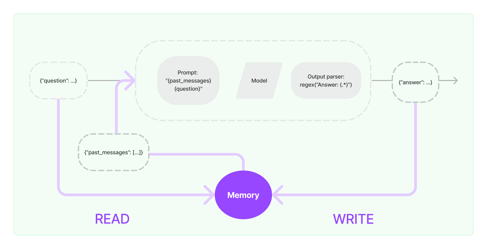

# LangChain 核心模块学习：Memory

大多数LLM应用都具有对话界面。对话的一个重要组成部分是能够引用先前在对话中介绍过的信息。至少，一个对话系统应该能够直接访问一些过去消息的窗口。更复杂的系统将需要拥有一个不断更新的世界模型，使其能够保持关于实体及其关系的信息。

我们将存储过去交互信息的能力称为“记忆（Memory）”。

LangChain提供了许多用于向应用/系统中添加 Memory 的实用工具。这些工具可以单独使用，也可以无缝地集成到链中。

一个记忆系统（Memory System）需要支持两个基本操作：**读取（READ）和写入（WRITE）**。

每个链都定义了一些核心执行逻辑，并期望某些输入。其中一些输入直接来自用户，但有些输入可能来自 Memory。

在一个典型 Chain 的单次运行中，将与其 Memory System 进行至少两次交互:

1. 在接收到初始用户输入之后，在执行核心逻辑之前，链将从其 Memory 中**读取**并扩充用户输入。
2. 在执行核心逻辑之后但在返回答案之前，一个链条将把当前运行的输入和输出**写入** Memory ，以便在未来的运行中可以引用它们。

