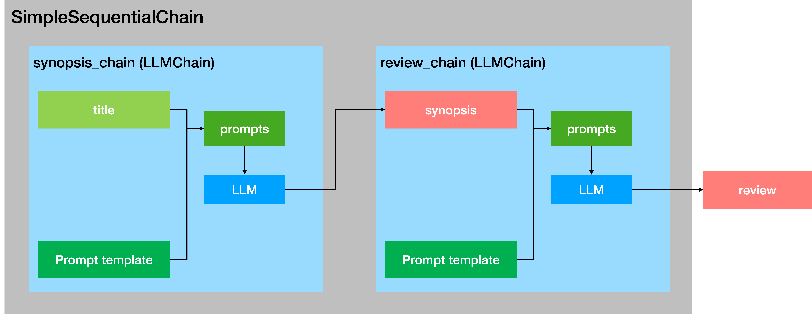

# LangChain 核心模块学习：Model I/O

`Model I/O` 是 LangChain 为开发者提供的一套面向 LLM 的标准化模型接口，包括模型输入（Prompts）、模型输出（Output Parsers）和模型本身（Models）。

* Prompts：模板化、动态选择和管理模型输入
* Models：以通用接口调用语言模型
* Output Parser：从模型输出中提取信息，并规范化内容

